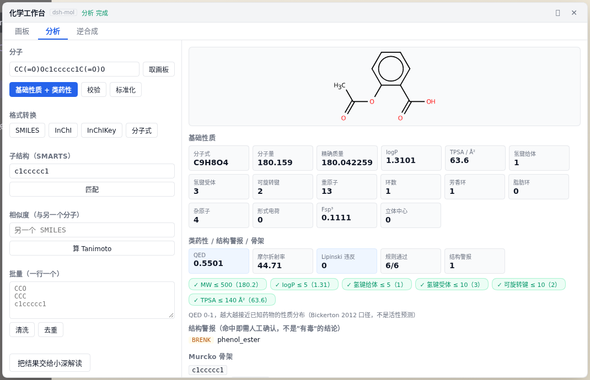
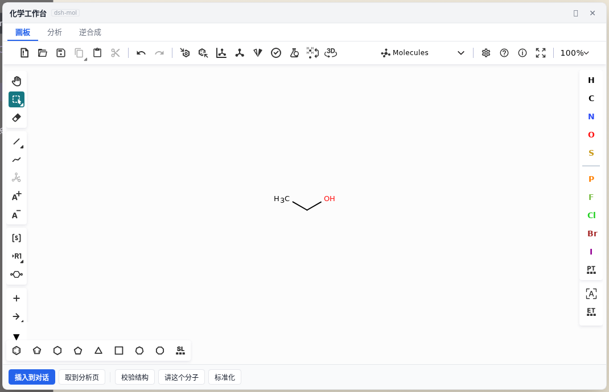
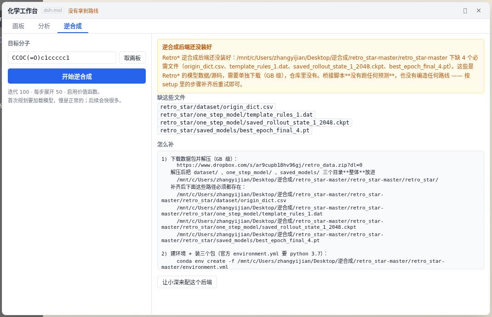
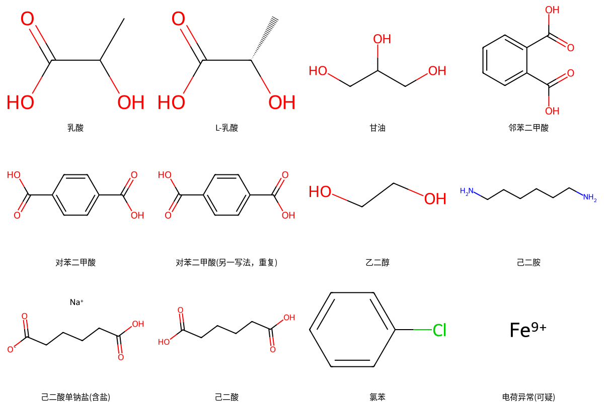

<div align="center">

# dsh-mol · a chemistry workbench

**A molecule sketchpad plus a local RDKit workbench, sitting next to your AI agent's chat box.**

Draw a structure → click once → formula / MW / logP / TPSA / drug-likeness / structural alerts **computed on the spot** →
drop the structure into the conversation and let the agent take it from there.

Pure RDKit. **No network, no API key, no external service.** Also usable as a stdio MCP server, callable directly by Claude Code / Codex.

[](https://github.com/Yijian-quiet/dsh-mol/actions/workflows/ci.yml)


[中文](README.md) | English



</div>

---

## Understand it in 30 seconds

| | |
|---|---|
| 🎨 **Draw molecules** | One button next to the chat box → a Ketcher canvas overlay. **The chat is not pushed aside**, and one click inserts the structure into the input box |
| ⚡ **Instant analysis** | Formula, MW, exact mass, logP, TPSA, HBD/HBA, rings, Fsp³, stereocenters — computed **right now** by local RDKit, no model call, no waiting on an LLM |
| 💊 **Drug-like or not** | Lipinski / Veber rule-by-rule verdicts, QED, PAINS / BRENK structural alerts, Murcko scaffold |
| 🧹 **Dirty-data first aid** | Validation (plain-language errors + character positions), standardization (every change recorded), dedupe, batch cleanup |
| 🧭 **Retrosynthesis** | The tab is in place and the backend is pluggable (Retro* today). **If the model data is not installed, it says so honestly — it never invents a route** |
| 🔌 **Two ways in** | The graphical workbench is for people; the same core reaches agents over MCP — **one implementation, two entry points** |

> Some context: npm has **618** DSH plugins, of which **0** are chemistry / materials / molecules.
> This repo exists to fill that gap.

---

## Quick start

```bash
# 1) Install the core + MCP adapter (no PyPI account needed — straight from git)
pip install "dsh-mol[mcp] @ git+https://github.com/Yijian-quiet/dsh-mol.git"

# 2) Install the plugin into your DSH profile (no npm account needed; pnpm handles git subdirectories)
dsh plugin --profile web add 'github:Yijian-quiet/dsh-mol#path:dsh-bundle'
dsh plugin --profile web add 'github:Yijian-quiet/dsh-mol#path:dsh-ui'   # ← the graphical workbench

# 3) Open DSH Web and click "workbench" to the left of the input box
```


> ⏳ **Not yet on PyPI / npm** (checked 2026-09-26: `dsh-mol`, `dsh_mol` and `dshmol` all 404 on
> PyPI; `dsh-mol` and `dsh-chem-ui` are unpublished on npm), so the commands above install
> **straight from git** — that is the route that works today. The package names are still free;
> `pip install 'dsh-mol[mcp]'` and `dsh plugin add dsh-mol` start working once published.
>
> ✅ Listed in the [DSH plugin market](https://awesome-dsh-plugin.com) (entries
> `dsh-mol#dsh-ui` and `dsh-mol#dsh-bundle`, category `tools`) — you can also install it there.

The workbench needs a local `python3` that can `import rdkit`; the canvas is a [Ketcher](https://github.com/epam/ketcher) static build that **renders locally in the browser and goes through no backend**.

<details>
<summary>Command line only, or a different MCP client?</summary>

```bash
dsh-mol-mcp --selftest          # self-check first (no MCP client required)
```

```yaml
# overlay the patch by hand; stdio transport, fully local
- insert:
    - id: dsh-mol
      name: '@deepseek-ai/dsh-mcp-client'
      config:
        serverName: chem
        transport: stdio
        command: python3
        args: ['-m', 'dsh_mol_mcp.server']
        env:
          PYTHONPATH: /path/to/dsh-mol/src
          MOL_OUT: /path/to/out
```

Tools show up on the model side as `mcp__chem__chem_check_smiles` and friends.
</details>

---

## What the workbench looks like

Three tabs, one molecule:

<table>
<tr>
<td width="33%"><br><b>① Draw</b><br>The full Ketcher canvas (the overlay drags and maximizes). "Insert into chat" writes the SMILES into the input box — <b>the text is the structure alone, with no internal path smuggled in</b>.</td>
<td width="33%"><br><b>② Analyze</b><br>Input and buttons on the left, numbers on the right. Basic properties + drug-likeness + structural alerts + scaffold in one pass, all computed live by local RDKit.</td>
<td width="33%"><br><b>③ Retrosynthesis</b><br>Target molecule → multi-step route. With no model data installed, <b>it tells you what to download and where to put it</b> instead of pretending it computed something.</td>
</tr>
</table>

### Why isn't the drawing rendered in the panel?

Because **an image should follow the prose that explains it**. The thumbnail in the workbench only confirms *which molecule* was computed;
the real structure image is drawn inline by the agent in its reply (`read_image`), right next to its explanation of that molecule.

That call came after two rejected versions:
first "the panel eats the main area and squeezes the chat out", then "a second preview inside the canvas is useless".
Now **the chat keeps its layout and the workbench sits beside it**.

---

## Why not just wrap RDKit

Because a naive wrapper hands an AI agent three traps, and all three bite for real in research work:

### 1. When RDKit fails to parse it **does not raise** — it returns `None`

The reason goes to a C++ stderr log. Under a naive wrapper the model only gets an empty `None` and has no idea what went wrong.
This toolchain reroutes and captures the RDKit log, **translates it into plain language**, and gives a **character position** where one can be located:

```jsonc
// chem_check_smiles("C1CC")
{ "level": "error",
  "diagnostics": [{ "code": "unclosed_ring",
                    "message": "环闭合标记没有配对：SMILES 里的成环数字（如 C1...C1）出现次数必须是偶数" }] }

// chem_check_smiles("CC(=O)O)")   ← one closing paren too many, located at character 7
{ "level": "error", "position": 7,
  "diagnostics": [{ "code": "extra_paren", "message": "多余的右括号：) 比 ( 多" }] }
```

### 2. `MolFromSmiles("")` does not return `None` — it returns **an empty 0-atom molecule**

A naive implementation would call empty input **valid**. Yet `"   "` (whitespace only) **does** return `None` —
one function, two kinds of empty input, two behaviours. This toolchain catches both at the domain layer.

### 3. Results are **three-valued**, not pass/fail

`[Fe+9]` parses, but the charge is absurd. That deserves a *warning*, not a rejection:

| level | meaning |
|---|---|
| `ok` | clean |
| `warn` | parses, but the structure is suspicious (unusual charge, dubious aromaticity…), with reasons |
| `error` | parse failure, with a plain-language reason and a locatable character position |

**And batch APIs never drop data silently.** Every row is accounted for (ok / warn / failed),
with failures listed one by one — in research data, "two rows quietly went missing" is far more dangerous than an error.

### Diagnostics are bilingual

Chinese by default; one environment variable switches an English environment over:

```bash
export MOL_LANG=en        # zh (default) / en
```

> ⚠️ **The contract is `code`, not the message text.** `code` (`unclosed_ring` / `valence` …) is language-independent,
> and it **does not change `level` / `position` / `canonical` when the language changes** — dedicated regression cases lock this down.

---

## Tools (12, all local-only)

| Tool | Purpose |
|---|---|
| `chem_check_smiles` | validate + canonicalize: three-valued result, plain-language reasons, character position |
| `chem_properties` | formula / MW / exact mass / logP / TPSA / HBD / HBA / rings / stereocenters |
| `chem_analyze` | everything at once: basic properties + drug-likeness + structural alerts + Murcko scaffold |
| `chem_druglikeness` | Lipinski / Veber rule-by-rule verdicts, QED, PAINS / BRENK structural alerts |
| `chem_draw_molecule` | render a structure (PNG/SVG, optional atom indices, substructure highlight) → returns a **file path** |
| `chem_draw_grid` | multi-molecule grid (for reports/papers); bad entries skipped but recorded one by one |
| `chem_convert` | smiles / inchi / inchikey / mol / sdf / formula conversion |
| `chem_standardize` | strip salts / disconnect metals / neutralize / normalize — **recording every change** |
| `chem_dedupe` | deduplicate by canonical structure, with duplicate groups |
| `chem_substructure_match` | SMARTS substructure matching, returns atom indices |
| `chem_similarity` | fingerprint similarity (morgan / rdkit / maccs) |
| `chem_batch_clean` | clean a column of SMILES: count summary + failure list (+ optional CSV report) |

The workbench's "Analyze" tab and these tools **share the same `chemcore`** — there is no drift between "the UI computes one thing and the agent another".

> `chem_core` also has a `python3 -m chemcore.cli` JSON entry point (one JSON line in, one JSON line out);
> the workbench's live numbers go through it. That is the seam where "tools for the AI" and "a UI for people" share one implementation.

## Python API

```python
import chemcore as cc

cc.check("C1CC").diagnostics[0].message   # '环闭合标记没有配对：…'
cc.properties("CC(=O)Oc1ccccc1C(=O)O")    # {'formula': 'C9H8O4', 'mw': 180.159, …}
cc.analyze("CC(=O)Oc1ccccc1C(=O)O")       # + QED / Lipinski / PAINS alerts / Murcko scaffold
cc.draw("CCO", atom_indices=True)         # {'path': '…/CCO.png', …}
cc.standardize("CC(=O)[O-].[Na+]")        # {'output': 'CC(=O)O', 'changes': [...]}
cc.batch_clean(["CCO", "C1CC"])           # {'ok': 1, 'failed': 1, 'failed_items': [...]}
```

## Worked example: cleaning a dirty monomer table

[`examples/monomer_cleanup.py`](examples/monomer_cleanup.py) takes a deliberately messy monomer table
(the same molecule written two ways, a sodium salt, a ring-closure typo, an impossible valence, an absurd charge) and runs the whole chain:

```bash
python3 examples/monomer_cleanup.py
```

It reports `11 ok · 1 warn · 2 failed`, merges the duplicates, walks through each salt-stripping and neutralization step,
and draws the 12 renderable structures while listing the 2 skipped ones together with their reasons.



## Retrosynthesis

The retrosynthesis tab's backend is **pluggable**: the plugin uses `child_process` to start a process that takes JSON on stdin
and writes JSON to stdout, pointing at the Retro* bridge script in this repo by default.

- When the backend is **not installed**: it returns a structured diagnostic (which files are missing, where to download them, where to put them) and the UI shows that honestly —
  **it does not invent a route**, and it does not paper over the gap with something that merely "looks like" one
- To swap the backend (AiZynthFinder / your own RetroChimera / your group's internal server): keep to the same
  stdin/stdout protocol and point `retroCommand` at it

Installing Retro* (source + model data, GB-scale) is covered in **[docs/RETROSYNTHESIS.md](docs/RETROSYNTHESIS.md)**.

## Tests

```bash
PYTHONPATH=src python3 tests/run_tests.py    # 52 core cases (zero deps, no pytest needed)
PYTHONPATH=src python3 tests/mcp_smoke.py    # MCP protocol smoke (real server, real tool calls)
bash tests/run_all.sh                        # the two above plus self-checks, in one shot
```

The UI is accepted headless with Playwright (26 assertions, covering "can you still use the chat after opening the workbench",
"are those numbers actually computed", and "does it invent a route when the backend is not installed"):

```bash
dsh web --port 3081 --no-open > /tmp/chemver.log 2>&1 &
CHEM_BASE=http://127.0.0.1:3081 \
CHEM_TOKEN=$(grep -o 'token=[^ ]*' /tmp/chemver.log | cut -d= -f2) \
node dsh-ui/tests/verify-ui.cjs
```

> Do not experiment on the port you are using — start a separate instance and shut it down when you are done.

## Design principles

1. **Zero network**: every computation happens in this process.
2. **Zero extra dependencies**: the core needs only RDKit; the tests don't even need pytest.
3. **Failures speak human**: RDKit's English C++ logs become graded diagnostics.
4. **No silent data loss**: batch APIs report every row.
5. **State your terms**: logP is flagged as a Crippen estimate; `mw` and `exact_mw` are each explained.
6. **Write files, return paths**: images are not stuffed into protocol payloads but written to disk and returned as a path — reproducible, versionable, paper-ready.
7. **Say what's missing**: no experimental values, no activity prediction; if the retrosynthesis backend isn't installed, say it isn't installed.

## Roadmap

- **v0.1 (current)**: 12 local-only tools + the chemistry workbench (canvas / analyze / retrosynthesis framework)
- **v0.2**: retrosynthesis backend running end to end (Retro* data in place) + view routes inside the workbench
- **v0.3**: more analysis cards (pKa / conformers / PK properties), visualization upgraded to "structure + charts"
- **Undecided**: image → structure (OCSR) needs a several-hundred-MB model, so it is **not a "light basic tool"** and will ship as a pluggable backend

## Boundaries

- There are **no experimental values** here. `logP`, `TPSA` and `QED` are computed/estimated and do not replace measurement.
- A structural alert **does not mean** "toxic": it only means "this kind of substructure deserves a human look".
- There is **no** image recognition and **no** name → structure (OPSIN and the like).
- SMARTS matching is structural matching, **not** a reactivity judgement.
- **InChI does not support the `*` dummy atom**: polymer RU-SMILES (e.g. `*OCCOC(=O)c1ccc(C(=O)O*)cc1`) **cannot** be converted to InChI / InChIKey.
  We **do not silently return an empty string** (RDKit does); we raise a clear error and suggest canonical SMILES as the unique identifier —
  because the most common input in this field is exactly the one carrying `*`.
- This is `v0.0.1`: the API may change; issues are welcome.

## Repository layout

```
src/chemcore/          pure RDKit core (single source of truth) + JSON CLI entry
src/dsh_mol_mcp/       stdio MCP adapter (12 tools)
dsh-ui/                chemistry workbench (DSH client plugin: host half + browser half)
dsh-ui/retro/          retrosynthesis backend bridge (pluggable, Retro* by default)
dsh-bundle/            DSH bundle (configuration only, pointing at the MCP server above)
dsh/                   patch for manual overlay (hard-coded local paths)
tests/                 zero-dependency tests + MCP protocol smoke + Playwright UI acceptance
docs/                  demo images and deep-dive docs
```

## A requirement worth knowing

**The MCP Python SDK must be 1.x**:

```bash
pip install 'mcp>=1.0,<2'
```

SDK **2.x renamed `FastMCP` to `MCPServer`** with breaking API changes.
Our `[mcp]` extra already pins `<2`; if you installed 2.x by hand, `dsh-mol-mcp` **tells you exactly what to do**
(instead of dumping a traceback) — CI found this trap on a clean environment, it is not a guess.

## Acknowledgements

- [RDKit](https://www.rdkit.org/) — the entire chemistry core
- [Ketcher](https://github.com/epam/ketcher) — the canvas (local wasm rendering, no network)
- [Retro*](https://github.com/binghong-ml/retro_star) (ICML 2020) — one of the retrosynthesis backends

## License

MIT
