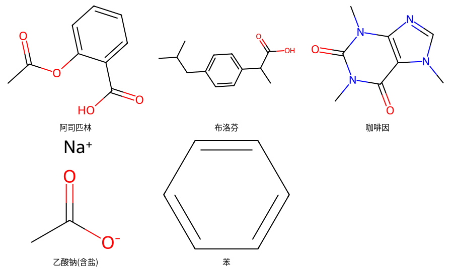

# chemworkbench · 本地优先的化学工作台

> **English**: A local-first chemistry workbench for AI agents — SMILES validation with
> human-readable diagnostics, structure drawing, properties, format conversion,
> standardization and batch cleaning. Pure RDKit, no network, no API key.
> Exposes itself as a **stdio MCP server**, so DeepSeek Harness / Claude Code / Codex
> can use it directly.

把化学里最高频的那点基础活，做成**AI agent 能可靠调用**的本地工具：

**校验 SMILES、画分子、算性质、转格式、做标准化、批量清洗。**

纯 RDKit，**零网络、零 API key、零外部服务**。以 stdio MCP 服务的形式暴露，
所以 DSH / Claude Code / Codex 都能直接用。



*`draw_grid` 输出：中文图注自行排版；坏条目被跳过但逐条记录原因（`C1CC` → 环未闭合）。*

---

## 状态

| | |
|---|---|
| 版本 | `0.0.1`（早期，API 可能变） |
| 测试 | 29 个核心用例 + 11 项自测 + MCP 协议级冒烟，**全绿** |
| 发布 | ⏳ 尚未发布到 PyPI / GitHub |
| 依赖 | `rdkit`（核心）；`mcp`（仅 MCP 适配层需要） |
| 许可 | MIT |

---

## 为什么不是"包一层 RDKit"

因为直接包一层会给 AI agent 三个坑，而这三个坑在科研场景里都会真实咬人：

### 1. RDKit 解析失败时**不抛异常**，只返回 `None`

失败原因写在 C++ 层的 stderr。天真包装下，模型只会拿到一个空洞的 `None`，
完全不知道错在哪。本工具把 RDKit 日志改道、捕获、**翻译成中文人话**，
并在能定位时给出**字符位置**：

```jsonc
// chem_check_smiles("C1CC")
{ "level": "error",
  "diagnostics": [{ "code": "unclosed_ring",
                    "message": "环闭合标记没有配对：SMILES 里的成环数字（如 C1...C1）出现次数必须是偶数" }] }

// chem_check_smiles("CC(=O)O)")   ← 多余右括号，定位到第 7 个字符
{ "level": "error", "position": 7,
  "diagnostics": [{ "code": "extra_paren", "message": "多余的右括号：) 比 ( 多" }] }
```

### 2. `MolFromSmiles("")` 返回的不是 `None`，而是**一个 0 原子的"空分子"**

天真写法会把空输入判成**合法**。而 `"   "`（纯空白）**又会**返回 `None`——
同一个函数，两种空输入两种行为。本工具在领域层统一拦住。

### 3. 结果要**分三级**，不是"成功/失败"

`[Fe+9]` 能解析，但电荷荒谬。这类应该**警告**而不是拒绝：

| level | 含义 |
|---|---|
| `ok` | 干净通过 |
| `warn` | 能解析，但结构可疑（异常电荷、芳香性可疑…），附带原因 |
| `error` | 解析失败，附人话原因 + 可定位的字符位置 |

**并且：批量接口绝不静默丢数据。** 每一行都有明确归属（ok / warn / failed），
失败逐条列出——科研数据里"悄悄少了两行"比报错危险得多。

---

## 安装

```bash
# 核心（只需 RDKit）
pip install rdkit

# 本仓库（含 MCP 适配层）
pip install -e ".[mcp]"

# 如果不想装包，直接用源码跑
export PYTHONPATH=/path/to/chemworkbench/src
```

自测（不需要任何 MCP 客户端）：

```bash
PYTHONPATH=src python3 -m chemworkbench_mcp.server --selftest
```

## 作为 MCP 服务使用

stdio 传输，**纯本地，不联网**。（只有"远端 MCP"才走网络——这点常被混淆。）

配置片段（DSH 用 `@deepseek-ai/dsh-mcp-client`，其他客户端同理）：

```yaml
- insert:
    - id: chemworkbench
      name: '@deepseek-ai/dsh-mcp-client'
      config:
        serverName: chem
        transport: stdio
        command: python3
        args: ['-m', 'chemworkbench_mcp.server']
        env:
          PYTHONPATH: /path/to/chemworkbench/src
          CHEMWORKBENCH_OUT: /path/to/out
```

工具名会以 `mcp__chem__chem_check_smiles` 之类的形式出现在模型侧。

## 工具一览

| 工具 | 作用 |
|---|---|
| `chem_check_smiles` | 校验 + 规范化，三级结果 + 人话原因 + 字符定位 |
| `chem_properties` | 分子式 / MW / 精确质量 / logP / TPSA / HBD / HBA / 环数 / 手性中心 |
| `chem_draw_molecule` | 画结构图（PNG/SVG，可标原子编号、可高亮子结构），返回**文件路径** |
| `chem_draw_grid` | 多分子拼图（汇报/论文附图），坏条目跳过但逐条记录 |
| `chem_convert` | smiles / inchi / inchikey / mol / sdf / formula 互转 |
| `chem_standardize` | 去盐 / 去金属 / 中和 / 规范化，**逐步记录改了什么** |
| `chem_dedupe` | 按规范化结构去重，给出重复分组 |
| `chem_substructure_match` | SMARTS 子结构匹配，返回原子索引 |
| `chem_similarity` | 指纹相似度（morgan / rdkit / maccs） |
| `chem_batch_clean` | 批量清洗一列 SMILES，输出计数摘要 + 失败清单（可写 CSV） |

## Python API

```python
import chemcore as cc

cc.check("C1CC").diagnostics[0].message   # '环闭合标记没有配对：…'
cc.properties("CC(=O)Oc1ccccc1C(=O)O")    # {'formula': 'C9H8O4', 'mw': 180.161, …}
cc.draw("CCO", atom_indices=True)         # {'path': '…/CCO.png', …}
cc.standardize("CC(=O)[O-].[Na+]")        # {'output': 'CC(=O)O', 'changes': [...]}
cc.batch_clean(["CCO", "C1CC"])           # {'ok': 1, 'failed': 1, 'failed_items': [...]}
```

## 测试

```bash
PYTHONPATH=src python3 tests/run_tests.py    # 26 个核心用例（零依赖，不需要 pytest）
PYTHONPATH=src python3 tests/mcp_smoke.py    # MCP 协议级冒烟（真起服务、真调工具）
```

## 设计原则

1. **零网络**：所有计算在本进程完成。
2. **零额外依赖**：核心只用 RDKit；测试连 pytest 都不需要。
3. **失败说人话**：把 RDKit 的英文 C++ 日志翻译成分级中文诊断。
4. **不静默丢数据**：批量接口逐条报告。
5. **参数必带口径**：logP 会标注是 Crippen 估算值，`mw` / `exact_mw` 分别说明含义。
6. **落盘返回路径**：图片不塞进协议载荷，而是写文件返回路径——可复现、可进版本库、可写论文。

## 路线图

- **v0.1（当前）**：上表 10 个纯本地工具
- **v0.2**：DSH Cordis bundle 包装（一键安装 + 对话内渲染 + 设置页）
- **v0.3**：接 MCP 网络深度服务（分子性质预测、逆合成）
- **未定**：图像→结构识别（OCSR）需要数百 MB 的模型，**不属于"基础轻工具"**，将做成可插拔后端

## 边界

- 这里**没有**实验值。`logP`、`TPSA` 等是计算/估算值，不替代实验测量。
- 这里**没有**图像识别、名称→结构（OPSIN 之类）。
- SMARTS 匹配是结构匹配，**不等于**化学反应性判断。

## 许可

MIT
