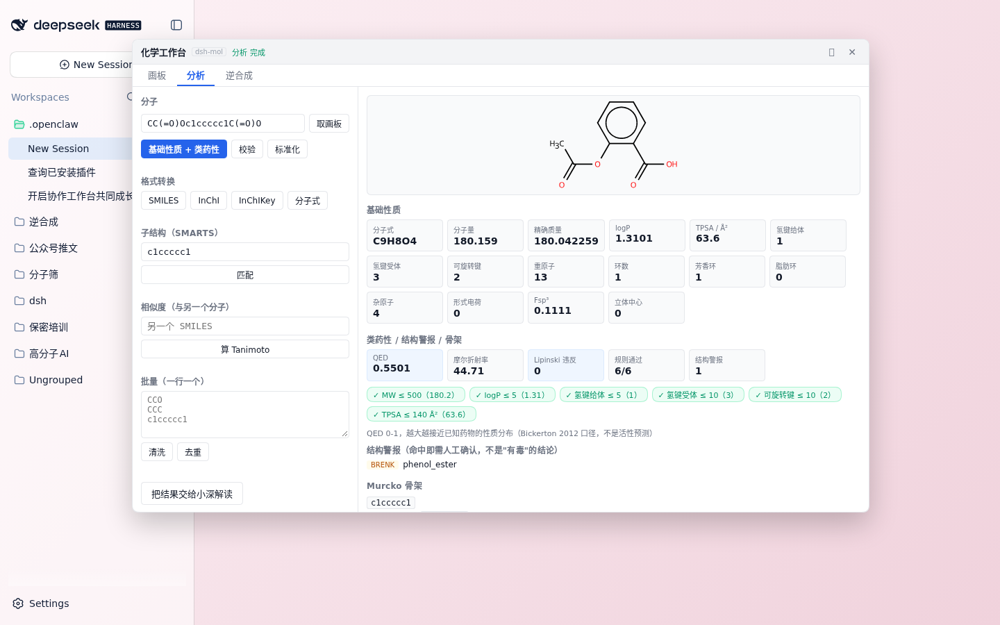

# dsh-chem-ui · 化学工作台（DSH Web UI 插件）

给 DeepSeek Harness 的**化学工作台**：聊天照常，输入框旁多一个「工作台」按钮，
点开一个**可拖动、可最大化的浮层**，里面三个页签：

```
输入框左侧 [🧪 工作台] → 浮层（不占主区域，聊天不被顶掉）
   ├─ 画板    Ketcher 全功能画板（浏览器本地 wasm 渲染，不经后端）
   ├─ 分析    本地 RDKit 现算：性质 / 类药性 / 结构警报 / 骨架 / 子结构 / 相似度 / 批量
   └─ 逆合成  多步路线规划（后端可插拔，默认 Retro*；没装好就如实说没装好）
                 ↓ 「插入到对话」/「交给小深」
           结构 + 任务写进**当前会话**的输入框 → 你补一句就发
```



---

## 交互设计（2026-09-25 按用户反馈改了两轮）

**第一版是错的**：把工作台注册成 `main` 面板 → 点开就**占掉整个主区域** →
聊天看不见了，结构被插进一个"你看不到的会话"里。用户原话："有点不太合理"。

**第二版也不对**：面板底部做了个"结构预览条"，在画板里再画一张小图。
用户原话："预览是在画布里的，这本身没什么用"。

**现在**：聊天保持原样，工作台在旁边；图交给 agent 在回复里画。

### 结构图出现在**聊天里**，不在工作台里（但工作台里有一张缩略图）

这两件事不一样，别混：

- **工作台里的缩略图**：界面的一部分，作用是"确认我算的是不是这个分子"。
  用 Ketcher 的 `generateImage()` 在浏览器本地渲（不联网、不经后端）
- **回复里的结构图**：由 agent 调 `read_image` 内联画出，旁边是它对这分子的解释

实测：DSH 的内联图卡**硬门控于 `read_image`**（源码写死
`if (call?.name !== "read_image") return null`），MCP 工具返回的图片内容块**拿不到图卡**，
`present` 也只产出交付卡片。所以"配图"这件事只能在 agent 侧做，插件不掺和。

### 插入的文本保持干净

写进输入框的**只有结构和任务**，例如：

```
CCO 请算一下这个分子的性质（分子式、MW、logP、TPSA、HBD、HBA、环数）：CCO
```

**不夹带任何内部提示**（曾经塞过 `[产物目录：…]`，用户明确要求去掉）。

### 为什么宿主半边必须存在

两个理由，缺一不可：

1. **Ketcher 必须同源**：客户端用 `<iframe>` 嵌它，然后读
   `iframe.contentWindow.ketcher.getSmiles()`。跨源会被同源策略挡掉 ——
   不能让用户另起一个静态服务，必须由插件在 DSH 这个源上提供
2. **即时数字必须本机现算**：如果算个分子量都要绕一圈问模型，这就不是工作台，
   只是个提示词发射器。宿主半边进程里 fork 一个 python（`python3 -m chemcore.cli`）
   就够了 —— 实测冷启动含 RDKit 导入约 0.2 秒

### 配色不要依赖主题变量

踩过：早先用 `var(--dsh-surface)` + `color: inherit`，深色主题下变成"浅色字 + 白底"，
文字直接看不见。Ketcher 本身就是浅色画布，所以整窗**固定浅色 + 显式色值**，
两种主题下都清晰。

---

## 安装

### 1) 拿 Ketcher 构建

Ketcher 的独立构建有 116 MB，**不能进 git**。一条命令搞定（约 35 MB 下载）：

```bash
node scripts/fetch-ketcher.mjs          # 默认解到 <包目录>/ketcher，版本 3.18.0
```

宿主半边按这个顺序找它，**找到一个就够，多数情况什么都不用配**：

```
配置 ketcherDir → 环境变量 CHEM_KETCHER_DIR → <包目录>/ketcher
→ <仓库根>/ketcher → ~/.cache/dsh-chem-ui/ketcher → ~/.dsh/ketcher
```

### 2) 把插件挂进 profile

```bash
dsh plugin --profile web add 'github:Yijian-quiet/dsh-mol#path:dsh-ui'
```

或者在本机 profile 的 `cordis.patch.yml` 里手写：

```yaml
- insert:
    - id: chem-ui
      name: 'dsh-chem-ui'
      config:
        # ketcherDir 不写也行，会按上面的顺序自动找
        retroHome: /path/to/retro_star-master      # 逆合成后端（可选）
        # python: /path/to/python3                 # 默认 python3，需能 import rdkit
        # retroCommand: 'python3 /path/to/your_bridge.py'   # 换后端（可选）
```

客户端半边改动后**要刷新页面**才生效（第三方插件没有 HMR）。

## 路由（宿主半边提供，都挂在 DSH 自己的源上）

| 路由 | 作用 |
|---|---|
| `GET /chem/ketcher/*` | Ketcher 静态构建（带目录穿越防护） |
| `POST /chem/tool` | `{op, ...}` → `python3 -m chemcore.cli` → RDKit 结果 |
| `POST /chem/retro` | 逆合成（默认转发给 `retro/retro_star_bridge.py`） |
| `GET /chem/status` | 能力自述：RDKit 通不通、逆合成配没配、Ketcher 挂没挂 |

刻意**避开 `/api` 前缀** —— 那一段是 DSH 自己的 RPC 与浏览器信任栅栏的地盘。
领域错误（比如 SMILES 画错了）用 **HTTP 200 + `{ok:false, code}`** 返回：
它是业务答案，不是 HTTP 故障。

## 验收（可自动化，不需要人盯屏幕）

```bash
dsh web --port 3081 --no-open > /tmp/chemver.log 2>&1 &   # 另起实例，别碰用户正在用的端口
NODE_PATH=<playwright 的 node_modules> \
CHEM_BASE=http://127.0.0.1:3081 \
CHEM_TOKEN=$(grep -o 'token=[^ ]*' /tmp/chemver.log | cut -d= -f2) \
CHEM_SHOTS=/tmp/chem-ui-shots \
node tests/verify-ui.cjs
```

26 条断言，覆盖的是**交互质量**而不是"元素存不存在"：

1. 工作台打开后**聊天仍可编辑**（核心诉求）
2. 三个页签都在；Ketcher 就绪
3. 画板 →「插入到对话」文本干净（不含内部路径提示）
4. 分析页签的数字**真的是 RDKit 算的**（乙醇 C2H6O / 46.069 / logP -0.0014 / TPSA 20.23）
5. **换个分子数字跟着变**（阿司匹林 C9H8O4 / 180.159）—— 防"渲染写死的假数"
6. 坏 SMILES 给**人话诊断**（"环闭合标记没有配对"）
7. 子结构匹配苯环命中
8. **逆合成没编造路线**（后端没装好时不许出现"路线 1"）且如实说明状态
9. 关闭后浮层消失、聊天照旧

> 两个踩过的坑写在脚本注释里：① 全新 browser context 会弹首次配置向导，
> 它拦截所有点击 → 必须先点掉；② 三个页签都常驻 DOM（只切 `display`），
> 选择器必须挑 `:visible` 的那个，否则 `.first()` 会命中隐藏页签里的输入框。

## 已知限制

- 客户端插件改动后**要刷新页面**才生效
- 浮层尺寸固定（1060×680，可拖动/可最大化）；还没有缩放把手
- 分析页签是"输入框 + 按钮"，还不能直接在缩略图上点原子做选区
- 逆合成页签的路线展示依赖后端返回树；Retro* 每次只给 1 条最优路线

## 路线

- **性质指标**：面板内直接给出分子式/MW/logP 等**文本指标**（已完成）
- **非法结构标红**：画板里画错时当场用人话提示（Ketcher 侧能力）
- **逆合成后端跑通**：Retro* 数据就位后，把路线图画出来
- **更多分析卡片**：pKa / 构象 / 代谢位点 —— 分析页签天然是它们的家

## 许可

MIT
