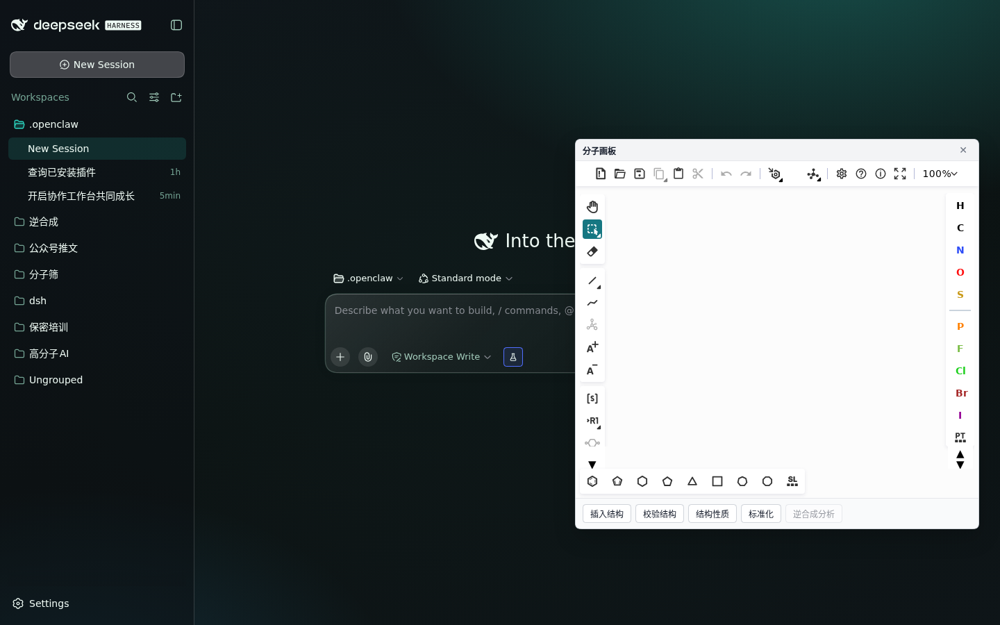

# dsh-chem-ui · 化学工作台（DSH Web UI 插件）

给 DeepSeek Harness 的**化学工作台**：**聊天照常**，输入框旁边多一个绘制按钮，
点开一个**可拖动的浮层画板**（Ketcher），用**化学功能按钮**把结构+任务布置给 agent。



*左：输入框旁的绘制按钮与完好的聊天；右：浮层画板 + 化学功能按钮。*

---

## 交互设计（2026-09-25 按反馈重做过一次）

**第一版是错的**：把工作台注册成 `main` 面板 → 点开就**占掉整个主区域** →
聊天看不见了，结构被插进一个"你看不到的会话"里。交互是断的。

**现在**：

```
输入框左侧 [🧪 绘制按钮]  → 点开浮层（可拖动、不占主区域）
                              ├─ Ketcher 画板（画/粘贴/载入，画布内可自行拖动）
                              └─ 化学功能按钮：插入结构 / 校验结构 / 结构性质 / 标准化 / 逆合成分析(待接)
                                        ↓ 点击
                              结构 + 任务指令写进**当前会话**的输入框 → 你补一句就发
```

### 结构图出现在**聊天里**，不在面板里

早先版本在面板底部放了个"结构预览条"——**用户否掉了**：画布本来就在眼前，再画一张小图没有意义。
真正有用的是**图跟着文字解释走**：

- agent 用 `dsh-mol` 画图后，**调 `read_image` 把图内联在回复里**（见 `$DSH_HOME/AGENTS.md` 的约定）
- 实测：DSH 的内联图卡**硬门控于 `read_image`**（源码写死
  `if (call?.name !== "read_image") return null`），MCP 工具返回的图片内容块**拿不到图卡**；
  `present` 只产出交付卡片，也不等于内联配图
- 所以"配图"这件事只能在 agent 侧做，插件不掺和

### 插入的文本保持干净

功能按钮写进输入框的**只有结构和任务本身**，例如：

```
CCO 请算一下这个分子的性质（分子式、MW、logP、TPSA、HBD、HBA、环数）：CCO
```

**不夹带任何内部提示**（曾经塞过 `[产物目录：…]`，用户明确要求去掉）。
产物按会话分目录是内部整洁，由 agent 侧静默完成：
`~/dsh-mol-out/sessions/<DSH_SESSION_ID 去前缀>/`（agent 从环境变量自己推，不打扰用户）。

### 为什么宿主半边必须存在

面板用 `<iframe>` 嵌 Ketcher，之后要读 `iframe.contentWindow.ketcher.getSmiles()`。
若 Ketcher 跑在别的端口就是**跨源**，同源策略直接挡掉 ——
所以必须由插件在 DSH 自己的源上提供（`ctx.webServer.register({ kind:'prefix', path:'/chem/ketcher' })`）。
**不能让用户另起一个静态服务。**

### 配色不要依赖主题变量

浮层最初写 `background: var(--dsh-surface)` + `color: inherit`，在深色主题下变成
**浅字白底、按钮和标题全都看不见**。现在用显式对比色（浅色卡片 + 深色文字）——
Ketcher 本身就是浅色画布，视觉上也协调。

## 安装

1. 取 Ketcher 独立构建（[ketcher-standalone](https://github.com/epam/ketcher/releases)），解压到任意目录
2. 把本包装进 profile，并在 patch 层挂载（`ketcherDir` 指向第 1 步的目录）：

```yaml
- insert:
    - id: chem-ui
      name: 'dsh-chem-ui'
      config:
        ketcherDir: /path/to/ketcher
```

> 开发期可以 `pnpm add <本目录>` 后只改 profile 的 `cordis.patch.yml`——
> 若该 profile 是 `patchReload: live`，**不必重启 dsh**（实测热加载生效）。

3. **刷新页面**（客户端 bundle 是懒加载的）

## 验收（可自动化，不需要人盯屏幕）

```bash
CHEM_BASE=http://127.0.0.1:3080 CHEM_TOKEN=<token> node tests/verify-ui.cjs
```

需要 Playwright（`npx playwright` 会带 chromium）。断言 12 项 + 分步截图：

1. 聊天输入框存在且可编辑（**聊天功能保留**）
2. 输入框旁出现「绘制分子」按钮
3. 点击后出现浮层画板，且**聊天输入框仍在**（没顶掉聊天）
4. Ketcher 画板就绪
5. 画板**可拖动**
6. 「插入结构」把 SMILES 写进输入框
7. 「插入结构」写入的文本**保持干净**（不含内部路径提示）
8. 「结构性质」写入带结构的任务指令
9. 关闭画板后浮层消失、**聊天仍可编辑**（核心诉求）

## 已知限制

- 客户端插件**改动后要刷新页面**才生效（没有第三方插件级别的 HMR）
- 「逆合成分析」按钮已占位，需平台侧能力接入后才可用
- 浮层尺寸固定（580×560，可拖动）；还没有缩放把手
- 面板内暂不显示分子性质——目前靠功能按钮把任务交给 agent 去算

## 路线

- **性质指标**：面板内直接给出分子式/MW/logP 等**文本指标**（复用同仓 `chemcore`）——是文字，不是再画一张图
- **非法结构标红**：画板里画错时当场用人话提示
- **逆合成分析**：接平台侧能力后启用按钮

## 许可

MIT
